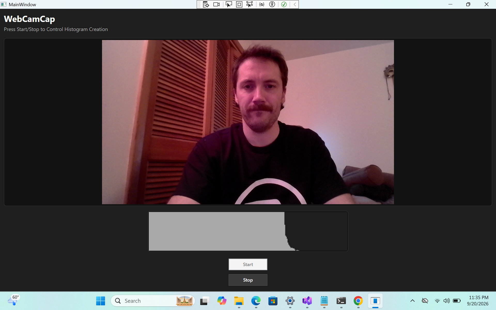

# WebCamCap - Web Camera Capture

This is a simple desktop application for Windows that continuously captures images from the users webcam (if one is present), and displays a histogram of the grayscale values for the images. This repo contains the application code, offers binary releases as .zip archives, and has CI (GitHub Action) that invoke unit tests (xunit).

## Code

This repo contains a .snlx file for use with Visual Studio, and two projects - the main WebCamCap project (WPF), and the tests in WebCamCapTest (xunit).

## Usage

### Download the .exe
1. Go to the "Releases" page and download the latest Release in .zip format: [Releases](https://github.com/emgullufsen/WebCamCap/releases)
2. Extract the .zip archive on your computer.
3. Run the .exe from the extracted folder.

### Using the .exe
1. The application is one main window, with a Start and Stop button for Starting/Stopping reading from the WebCam.

## CI

This application has a [test workflow](https://github.com/emgullufsen/WebCamCap/blob/main/.github/workflows/test.yml) and a [release workflow](https://github.com/emgullufsen/WebCamCap/blob/main/.github/workflows/release.yml). The test workflow runs on pushes and PRs to the "main" branch of this repo, and simply runs the xunit tests.

## Building from Source

If you prefer to build from source, please follow these instructions (on a Windows machine).